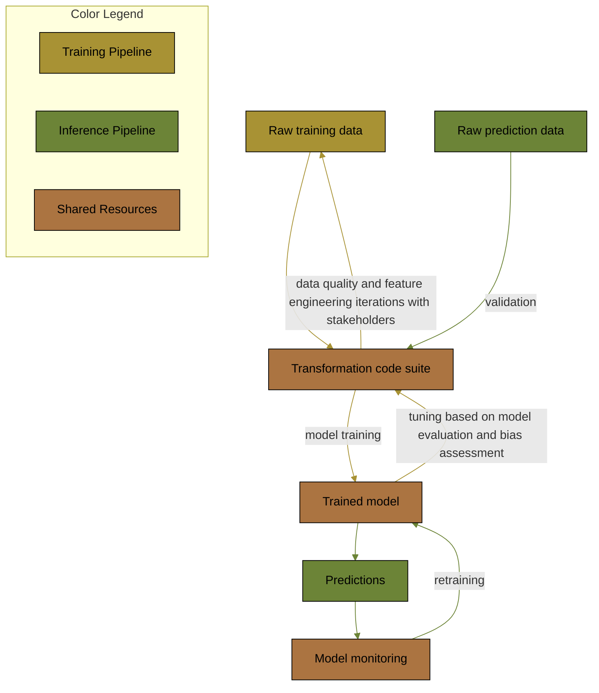

```mermaid
flowchart TD
    raw_train_data[Raw training data]-->transform[Transformation code suite]-- data quality and feature engineering iterations with stakeholders -->raw_train_data
    transform-- model training -->model[Trained model]-- tuning based on model evaluation and bias assessment -->transform
    monitoring[Model monitoring]-- retraining -->model
    linkStyle 0,1,2,3 stroke:#A89234,color;

    raw_test_data[Raw prediction data]-- validation -->transform
    model-->predictions[Predictions]-->monitoring
    linkStyle 4,5,6,7 stroke:#6C8437,color;

   subgraph legend [Color Legend]
       trainLegend[Training Pipeline]
       inferenceLegend[Inference Pipeline]
       sharedLegend[Shared Resources]
   end

   classDef training_pipeline fill:#A89234,stroke:#000000,color:#000000;
   class trainLegend,raw_train_data training_pipeline;

   classDef inference_pipeline fill:#6C8437,stroke:#000000,color:#000000;
   class inferenceLegend,raw_test_data,predictions inference_pipeline;

   classDef shared_resources fill:#AB7441,stroke:#000000,color:#000000;
   class sharedLegend,transform,model,monitoring shared_resources;


```