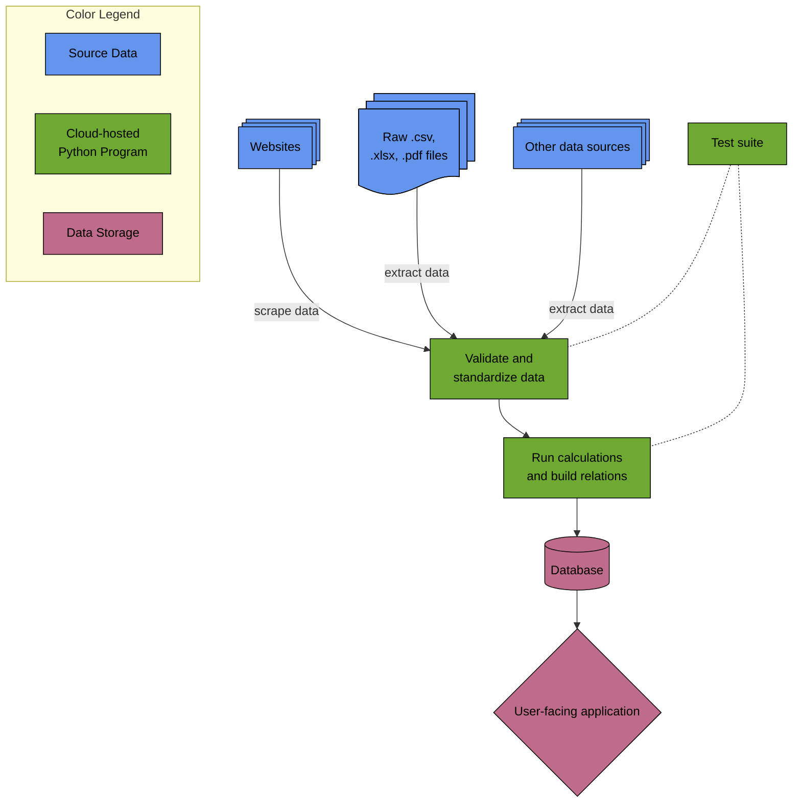

```mermaid
graph TD;
    websites@{ shape: processes, label: "Websites"}-- scrape data -->processor@{ shape: rect, label: "Validate and \nstandardize data"}
    files@{ shape: docs, label: "Raw .csv, \n.xlsx, .pdf files" }-- extract data -->processor
    source_x@{ shape: processes, label: "Other data sources"}-- extract data -->processor
    processor-->calculator@{ shape: rect, label: "Run calculations \nand build relations"}
    tester[Test suite]-.-processor
    tester-.-calculator
    calculator-->database[(Database)]-->app{User-facing application}


   subgraph legend [Color Legend]
       sourceLegend[Source Data]
       programLegend@{ shape: rect, label: "Cloud-hosted \nPython Program"}
       useLegend[Data Storage]
   end

   classDef sourceData fill:#6495ED,stroke:#000000,color:#000000;
   class sourceLegend,websites,files,source_x sourceData;

   classDef program fill:#6EAA32,stroke:#000000,color:#000000;
   class programLegend,processor,calculator,tester program;

   classDef use fill:#BF6C8A,stroke:#000000,color:#000000;
   class useLegend,database,app use;
```
